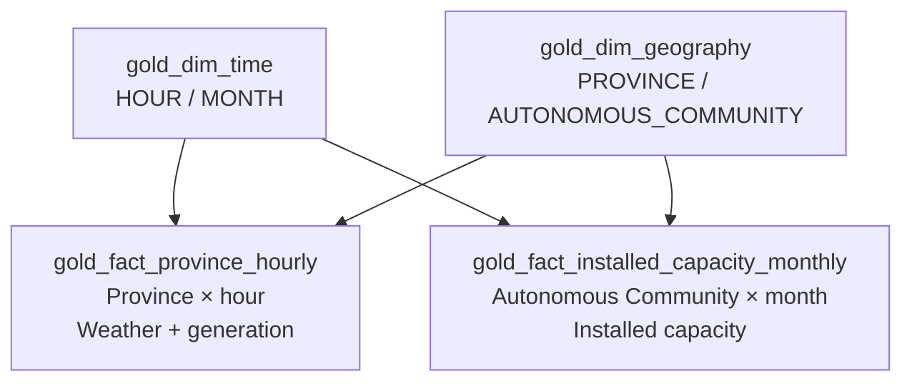

# Gold Layer Design

## 1. Purpose

This document defines the final design of the Gold layer of the
Energy Lakehouse Platform.

Gold consumes exclusively normalized and validated Silver datasets and
produces the analytical model exposed to downstream SQL and visualization
tools.

The processing path is:

```text
Apache Iceberg Silver
        │
        ▼
Apache Spark / PySpark
        │
        ├── geographical aggregation
        ├── temporal aggregation
        ├── source fallback
        ├── energy preparation
        ├── cross-source integration
        └── analytical validation
        │
        ▼
Apache Iceberg Gold
        │
        ▼
       Trino
        │
        ▼
Apache Superset
```

The final Gold model is deliberately compact and contains exactly:

```text
4 physical tables
```

The two principal analytical grains are:

```text
Province × hour
```

and:

```text
Autonomous Community × month
```

Gold does not manufacture geographical or temporal detail that cannot be
supported by the validated Silver sources.

---

# 2. Final Analytical Scope

The principal analytical objective is to study the relationship between
meteorological conditions and electricity generation.

The final implemented use cases include analyses such as:

- wind speed versus wind generation;
- comparison of wind conditions at 80 m and 120 m;
- wind direction versus wind generation;
- solar radiation versus photovoltaic generation;
- direct normal irradiance versus photovoltaic generation;
- precipitation versus hydraulic generation;
- evolution of electricity generation by technology;
- territorial comparison between provinces;
- installed capacity by technology and Autonomous Community;
- comparison between installed capacity and available generation data.

The final project scope does **not** include:

```text
electricity demand
electricity market prices
ESIOS 5-minute analytical facts
national 5-minute Gold facts
national 15-minute Gold facts
```

---

# 3. Final Physical Gold Model

The final Gold layer contains exactly four Apache Iceberg tables.

## Fact tables

```text
gold_fact_province_hourly
gold_fact_installed_capacity_monthly
```

## Dimensions

```text
gold_dim_geography
gold_dim_time
```

Therefore:

```text
Final Gold physical tables = 4
```

The previously designed:

```text
gold_fact_country_15min
gold_fact_country_5min
```

are not part of the final physical Gold model.

---

# 4. Analytical Grains

The final facts use different analytical grains according to their real
source semantics.

| Table | Temporal grain | Geographical grain |
|---|---|---|
| `gold_fact_province_hourly` | Hour | Province |
| `gold_fact_installed_capacity_monthly` | Month | Autonomous Community |

The dimensions support those two analytical products.

The platform does not force every dataset into the same grain.

---

# 5. Geographical Principles

CNIG / IGN is the canonical territorial master.

The preferred analytical geography is Province when the source data can
validly support Province-level analysis.

The following levels remain conceptually different:

```text
Province
≠
Autonomous Community
≠
Spain
≠
Peninsula
```

The final physical Gold facts use only:

```text
PROVINCE
AUTONOMOUS_COMMUNITY
```

as fact grains.

Higher-level geographical scopes are not artificially expanded to provinces.

Installed-capacity values available at Autonomous Community level therefore
remain at Autonomous Community level.

---

# 6. `gold_fact_province_hourly`

## 6.1 Purpose

`gold_fact_province_hourly` is the principal analytical dataset of the
platform.

Its grain is:

```text
Province × hour
```

It integrates:

```text
meteorological information
+
hourly electricity-generation information
```

and provides a single analytical table for studying relationships between
weather conditions and electricity generation.

---

## 6.2 Silver Sources

The fact is built primarily from:

```text
silver_aemet_stations
silver_aemet_current_observations

silver_open_meteo_hourly
silver_open_meteo_15min

silver_esios_energy_hourly

silver_cnig_provinces
silver_cnig_autonomous_communities
```

Each Silver dataset is prepared independently before integration.

---

## 6.3 Physical Schema

The current physical table contains:

| Column | Type |
|---|---|
| `gold_timestamp` | TIMESTAMP WITH TIME ZONE |
| `time_key` | STRING |
| `geography_key` | STRING |
| `province_code` | STRING |
| `province_name` | STRING |
| `autonomous_community_code` | STRING |
| `autonomous_community_name` | STRING |
| `temperature` | DOUBLE |
| `humidity` | DOUBLE |
| `precipitation` | DOUBLE |
| `wind_speed_80m` | DOUBLE |
| `wind_direction_80m` | DOUBLE |
| `wind_speed_120m` | DOUBLE |
| `wind_direction_120m` | DOUBLE |
| `solar_radiation` | DOUBLE |
| `direct_normal_irradiance` | DOUBLE |
| `wind_generation_mwh` | DOUBLE |
| `solar_photovoltaic_generation_mwh` | DOUBLE |
| `solar_thermal_generation_mwh` | DOUBLE |
| `hydraulic_generation_mwh` | DOUBLE |
| `nuclear_generation_mwh` | DOUBLE |
| `combined_cycle_generation_mwh` | DOUBLE |
| `gas_natural_steam_turbine_generation_mwh` | DOUBLE |
| `gas_natural_cogeneration_mwh` | DOUBLE |
| `coal_generation_mwh` | DOUBLE |
| `other_renewables_generation_mwh` | DOUBLE |
| `total_generation_mwh` | DOUBLE |
| `temperature_source` | STRING |
| `humidity_source` | STRING |
| `precipitation_source` | STRING |
| `gold_created_at` | TIMESTAMP WITH TIME ZONE |

---

## 6.4 Natural Key

The natural key is:

```text
province_code
+
gold_timestamp
```

Exactly one analytical row may exist for each:

```text
Province × hour
```

Duplicate natural keys are considered a Gold processing error.

---

## 6.5 Geography

The geographical attributes are:

```text
province_code
province_name
autonomous_community_code
autonomous_community_name
geography_key
```

The physical fact remains Province-grained.

Autonomous Community is a hierarchical attribute and does not modify the
grain.

Canonical geography is obtained from CNIG.

---

# 7. Meteorological Preparation

Meteorological information is prepared independently from electricity data
before the final fact join.

The target intermediate grain is:

```text
Province × hour
```

Individual AEMET stations and Open-Meteo points therefore remain in Silver and
are not directly joined to ESIOS observations.

This avoids row multiplication.

Incorrect pattern:

```text
station
×
Open-Meteo point
×
ESIOS observation
```

Correct pattern:

```text
AEMET
→ Province × hour
```

```text
Open-Meteo
→ Province × hour
```

```text
ESIOS
→ Province × hour
```

Only the resulting blocks are integrated.

---

# 8. AEMET Aggregation

AEMET current observations represent station-level meteorological
measurements.

Station geography is resolved through the validated AEMET station catalogue
and CNIG territorial mapping.

Valid station observations are aggregated to:

```text
Province × hour
```

for the metrics supported by the source.

An observation whose station cannot be resolved to a valid province must not
be assigned an invented geography.

Such source observations remain available upstream in Silver.

---

# 9. Open-Meteo Hourly Aggregation

Open-Meteo hourly observations are available at the point/station level.

They are aggregated spatially to:

```text
Province × hour
```

using the available valid locations belonging to each province.

Relevant metrics include:

```text
temperature_2m
relative_humidity_2m
precipitation
shortwave_radiation
direct_normal_irradiance
```

The Gold analytical names are:

```text
temperature
humidity
precipitation
solar_radiation
direct_normal_irradiance
```

---

# 10. Open-Meteo 15-Minute Aggregation

The Silver table:

```text
silver_open_meteo_15min
```

preserves the 15-minute source grain.

Gold uses this dataset to derive hourly elevated-wind metrics.

The principal variables are:

```text
wind_speed_80m
wind_direction_80m
wind_speed_120m
wind_direction_120m
```

---

## 10.1 Wind Speed

For each meteorological point:

```text
15-minute observations
→ hourly average
```

Then:

```text
hourly point values
→ average across valid province points
```

The result is:

```text
Province × hour
```

for:

```text
wind_speed_80m
wind_speed_120m
```

---

## 10.2 Wind Direction

Wind direction cannot be aggregated using a simple arithmetic average.

Circular aggregation is required.

For each point:

```text
15-minute directions
→ circular hourly mean
```

Then:

```text
hourly point directions
→ circular provincial mean
```

The resulting metrics are:

```text
wind_direction_80m
wind_direction_120m
```

expressed in degrees.

---

# 11. Meteorological Source Fallback

AEMET is the preferred source for:

```text
temperature
humidity
precipitation
```

when a valid AEMET value exists for the corresponding:

```text
Province × hour × metric
```

The fallback rule is metric-specific.

```text
AEMET valid value
→ use AEMET
```

```text
AEMET value unavailable
→ use Open-Meteo
```

This rule is applied independently for each metric.

Therefore a single row can legitimately contain, for example:

```text
temperature      from AEMET
humidity         from Open-Meteo
precipitation    from AEMET
```

Source provenance is retained in:

```text
temperature_source
humidity_source
precipitation_source
```

Fallback is not equivalent to arbitrary data imputation.

---

# 12. Hourly ESIOS Generation

The hourly ESIOS source is:

```text
silver_esios_energy_hourly
```

The final indicator mapping is:

| Indicator ID | Gold metric |
|---:|---|
| 1159 | `wind_generation_mwh` |
| 1161 | `solar_photovoltaic_generation_mwh` |
| 1162 | `solar_thermal_generation_mwh` |
| 10035 | `hydraulic_generation_mwh` |
| 1153 | `nuclear_generation_mwh` |
| 1156 | `combined_cycle_generation_mwh` |
| 1158 | `gas_natural_steam_turbine_generation_mwh` |
| 1164 | `gas_natural_cogeneration_mwh` |
| 10036 | `coal_generation_mwh` |
| 10041 | `other_renewables_generation_mwh` |
| 10043 | `total_generation_mwh` |

The final active hourly scope therefore contains:

```text
11 ESIOS indicators
```

---

# 13. Hourly Energy Semantics

The configured hourly ESIOS generation observations represent hourly energy
metrics.

For the hourly analytical fact:

```text
Gold metric_mwh
=
corresponding normalized ESIOS hourly value
```

The hourly observation is not constructed using:

```text
AVG(value)
```

or:

```text
SUM(value)
```

across multiple source observations representing the same analytical key.

For analytical periods longer than one hour, hourly MWh values may subsequently
be summed by the query or visualization layer where appropriate.

---

## 13.1 Official Total Generation

Indicator:

```text
10043
```

is retained as:

```text
total_generation_mwh
```

It represents the official ESIOS total used by the analytical model.

It is not reconstructed by summing the selected individual technologies.

---

## 13.2 Sign Preservation

Source ESIOS values preserve their published sign.

Gold must not apply:

```text
ABS(value)
```

or unapproved sign inversions.

A valid published:

```text
0
```

also remains:

```text
0
```

and must not be interpreted as missing data.

---

# 14. ESIOS Temporal Alignment

Hourly ESIOS observations use the configurable Gold temporal alignment:

```text
gold_timestamp
=
observation_timestamp
+
configured gap
```

The current configuration is stored in:

```text
config/gold_config.json
```

using:

```json
{
  "esios_time_gap_hours": 1
}
```

The offset is therefore externalized rather than hardcoded in the
transformation.

The alignment is applied in Gold before meteorology-energy integration.

The monthly installed-capacity flow does not automatically use this hourly
alignment rule.

---

# 15. Province × Hour Integration

After independent preparation, Gold contains two intermediate blocks:

```text
Meteorological block
Province × hour
```

and:

```text
Energy block
Province × hour
```

Before joining them, uniqueness is validated independently on both sides.

The approved integration is:

```text
Meteorological Province × hour
          FULL OUTER JOIN
Energy Province × hour
```

using:

```text
province_code
gold_timestamp
```

This rule ensures that valid coverage from either source is retained.

---

## 15.1 FULL OUTER Semantics

The final fact can therefore contain three valid row types:

```text
weather + energy
weather only
energy only
```

When one source is absent:

```text
missing source metrics
→ NULL
```

The surviving source metrics remain available.

Gold does not require both meteorology and energy to exist before retaining a
valid analytical key.

---

# 16. NULL and Zero Semantics

The fundamental Gold rule is:

```text
published value = 0
→ 0
```

```text
missing source observation
→ NULL
```

Therefore:

```text
NULL ≠ 0
```

Gold must not use a general:

```text
COALESCE(metric, 0)
```

to manufacture observations.

Gold also does not automatically:

- interpolate gaps;
- fabricate timestamps;
- manufacture source records;
- replace absence with averages;
- replace absence with zero.

The AEMET/Open-Meteo fallback is a specific approved source-integration rule and
does not alter this principle.

---

# 17. `gold_fact_installed_capacity_monthly`

## 17.1 Purpose

This fact contains installed electricity-generation capacity by technology.

Its grain is:

```text
Autonomous Community × month
```

Installed-capacity information is not artificially disaggregated to provinces.

---

## 17.2 Silver Source

The principal Silver source is:

```text
silver_esios_installed_capacity_monthly
```

with CNIG used for canonical Autonomous Community normalization.

---

## 17.3 Physical Schema

The current physical table contains:

| Column | Type |
|---|---|
| `year_month` | STRING |
| `time_key` | STRING |
| `gold_month_timestamp` | TIMESTAMP WITH TIME ZONE |
| `source_timestamp` | TIMESTAMP WITH TIME ZONE |
| `geography_key` | STRING |
| `autonomous_community_code` | STRING |
| `autonomous_community_name` | STRING |
| `esios_geo_id` | BIGINT |
| `hydraulic_installed_capacity_mw` | DOUBLE |
| `wind_installed_capacity_mw` | DOUBLE |
| `solar_photovoltaic_installed_capacity_mw` | DOUBLE |
| `solar_thermal_installed_capacity_mw` | DOUBLE |
| `renewable_total_installed_capacity_mw` | DOUBLE |
| `nuclear_installed_capacity_mw` | DOUBLE |
| `coal_installed_capacity_mw` | DOUBLE |
| `combined_cycle_installed_capacity_mw` | DOUBLE |
| `other_renewables_installed_capacity_mw` | DOUBLE |
| `gold_created_at` | TIMESTAMP WITH TIME ZONE |

---

## 17.4 Natural Key

The natural key is:

```text
autonomous_community_code
+
year_month
```

Exactly one row may exist for each:

```text
Autonomous Community × month
```

---

# 18. Installed-Capacity Indicators

The final ESIOS mapping is:

| Indicator ID | Gold metric |
|---:|---|
| 1475 | `hydraulic_installed_capacity_mw` |
| 1485 | `wind_installed_capacity_mw` |
| 1486 | `solar_photovoltaic_installed_capacity_mw` |
| 1487 | `solar_thermal_installed_capacity_mw` |
| 10302 | `renewable_total_installed_capacity_mw` |
| 1477 | `nuclear_installed_capacity_mw` |
| 1478 | `coal_installed_capacity_mw` |
| 1483 | `combined_cycle_installed_capacity_mw` |
| 1488 | `other_renewables_installed_capacity_mw` |

The final active monthly scope therefore contains:

```text
9 ESIOS indicators
```

---

# 19. Installed-Capacity Semantics

Installed capacity represents power.

Its unit remains:

```text
MW
```

The transformation is conceptually:

```text
installed_capacity_mw
=
ESIOS value
```

Gold must not:

- convert installed capacity to MWh;
- sum MW values across months as if they represented energy;
- distribute CCAA capacity artificially between provinces.

---

## 19.1 Official Renewable Total

Indicator:

```text
10302
```

is retained as:

```text
renewable_total_installed_capacity_mw
```

This is the official ESIOS renewable installed-capacity total used by the
platform.

It is not reconstructed by summing the selected renewable technologies.

---

# 20. `gold_dim_geography`

## 20.1 Purpose

`gold_dim_geography` provides the common geographical dimension for the final
facts.

The current final physical dimension contains:

```text
Province members
+
Autonomous Community members
```

The validated cardinality is:

```text
71 rows
```

corresponding to:

```text
52 province-level entities
+
19 Autonomous Communities
```

No Country or Peninsula members are required by the final physical Gold facts.

---

## 20.2 Grain

Each row represents one canonical geographical member.

Valid levels in the final model are:

```text
PROVINCE
AUTONOMOUS_COMMUNITY
```

---

## 20.3 Key

The dimension uses:

```text
geography_key
```

as its deterministic analytical key.

Each fact row contains the corresponding:

```text
geography_key
```

appropriate to its grain.

The key must be unique within the geographical dimension.

---

## 20.4 Hierarchy

The canonical hierarchy is:

```text
Autonomous Community
        │
        ▼
      Province
```

For Province members, both Province and parent Autonomous Community attributes
can be retained.

For Autonomous Community members, Province attributes remain non-applicable.

Lower-level information is never manufactured.

---

# 21. `gold_dim_time`

## 21.1 Purpose

`gold_dim_time` provides the conformant temporal dimension used by the final
Gold facts.

The final physical model requires only:

```text
HOUR
MONTH
```

temporal members.

The validated current dimension contains:

```text
158 rows
```

for the currently persisted Gold state.

---

## 21.2 Time Key

The analytical temporal key is:

```text
time_key
```

and is physically present in both final fact tables.

The fact relationships are therefore:

```text
gold_fact_province_hourly.time_key
→
gold_dim_time.time_key
```

and:

```text
gold_fact_installed_capacity_monthly.time_key
→
gold_dim_time.time_key
```

The time key must be deterministic and unique.

---

## 21.3 Hour Members

Hourly members correspond to the actual:

```text
gold_timestamp
```

values required by:

```text
gold_fact_province_hourly
```

Calendar attributes can be derived from the timestamp for analytical
filtering and grouping.

---

## 21.4 Month Members

Monthly members correspond to:

```text
year_month
```

values required by:

```text
gold_fact_installed_capacity_monthly
```

Monthly members must not imply artificial hourly observations.

---

# 22. Dimension-to-Fact Relationships

The logical model is:

```text
                 gold_dim_time
                    │     │
                    │     │
                    ▼     ▼
gold_dim_geography ──► gold_fact_province_hourly


                 gold_dim_time
                    │
                    ▼
gold_dim_geography ──► gold_fact_installed_capacity_monthly
```

The cardinality is:

```text
dimension 1
→
N fact rows
```

There are no direct physical fact-to-fact relationships.

---

# 23. Logical Gold Model



---

# 24. Peninsula Definition

A validated Peninsular meteorological scope exists for geographical
aggregation logic.

The following province codes are excluded from the Peninsular scope:

```text
07
35
38
51
52
```

corresponding to:

```text
Illes Balears
Las Palmas
Santa Cruz de Tenerife
Ceuta
Melilla
```

However, the final physical Gold model does **not** materialize a dedicated
Peninsula fact table.

This definition remains available for analytical or quality logic requiring a
Peninsular scope without confusing:

```text
Spain
```

with:

```text
Peninsula
```

---

# 25. Integration Order

The approved Silver-to-Gold processing order is:

1. read validated Silver tables;
2. normalize or resolve geography;
3. apply ESIOS hourly temporal alignment where required;
4. perform temporal aggregation to the target grain;
5. perform geographical aggregation to the target grain;
6. resolve AEMET/Open-Meteo metric-level fallback;
7. produce meteorological and energy intermediate datasets;
8. validate intermediate natural-key uniqueness;
9. integrate compatible datasets;
10. validate resulting fact keys;
11. build Gold dimensions;
12. persist Gold as Apache Iceberg tables;
13. validate Gold through Trino.

The order protects the analytical grain from accidental row multiplication.

---

# 26. Duplicate Protection

Duplicates at an analytical grain are errors.

Gold must not silently hide them with an uncontrolled:

```text
dropDuplicates()
```

after an invalid join.

Required behaviour is:

```text
detect duplicate natural key
→ fail validation
```

rather than:

```text
detect duplicate natural key
→ arbitrarily discard rows
```

Uniqueness must be established before the principal integration joins.

---

# 27. Gold Data Quality

Gold quality controls validate both physical structure and analytical
correctness.

The principal controls include:

- non-null natural-key components;
- natural-key uniqueness;
- compatible timestamp grain;
- valid geographical mapping;
- compatible geographical grain;
- metric-level NULL preservation;
- preservation of ESIOS signs;
- correct source fallback;
- no artificial geographical expansion;
- no accidental row multiplication;
- dimension-key compatibility;
- correct unit semantics.

---

# 28. Natural-Key Controls

Required duplicate count:

```text
0
```

for:

### Province-hour fact

```text
province_code
+
gold_timestamp
```

### Installed-capacity fact

```text
autonomous_community_code
+
year_month
```

### Geography dimension

```text
geography_key
```

### Time dimension

```text
time_key
```

---

# 29. Structural NULL Controls

Required key fields must not be NULL.

For:

```text
gold_fact_province_hourly
```

the required analytical key includes:

```text
province_code
gold_timestamp
geography_key
time_key
```

For:

```text
gold_fact_installed_capacity_monthly
```

the required analytical key includes:

```text
autonomous_community_code
year_month
geography_key
time_key
```

Metric NULL values remain valid when they represent genuine source coverage
limitations.

---

# 30. Coverage Controls

Gold must preserve valid coverage from either source.

For the hourly fact, the FULL OUTER integration means that:

```text
weather only
```

is valid,

```text
energy only
```

is valid,

and:

```text
weather + energy
```

is valid.

Real source differences must not be treated automatically as processing errors.

The critical distinction is:

```text
source has no observation
```

versus:

```text
Gold transformation lost a valid source observation
```

---

# 31. Unit Controls

The final Gold model maintains explicit physical-unit semantics.

## Hourly generation

```text
MWh
```

## Installed capacity

```text
MW
```

The units must not be interchanged.

For exactly one hour, an average power value expressed in MW may be numerically
equal to the corresponding energy in MWh, but the physical magnitudes remain
different.

---

# 32. Gold Persistence

Gold is persisted using Apache Iceberg in MinIO.

The physical architecture is:

```text
Apache Spark
     │
     ▼
Gold transformations
     │
     ▼
Apache Iceberg
     │
     ▼
    MinIO
     ▲
     │
   Trino
```

Persistence must preserve the logical uniqueness of each Gold table.

Reprocessing the same source state must not introduce duplicate analytical
keys.

---

# 33. Idempotency

Gold processing is required to be logically idempotent.

Conceptually:

```text
same Silver input
+
same Gold transformation rules
=
same logical Gold result
```

Repeated execution may produce new Apache Iceberg metadata or snapshots, but
must not multiply analytical rows.

Natural-key validation is therefore mandatory after persistence.

---

# 34. Real End-to-End Gold Validation

The final Gold model was populated from real Silver data generated from the
historical validation interval:

```text
2026-01-10 → 2026-01-15
```

The current Gold namespace contains exactly:

```text
gold_dim_geography
gold_dim_time
gold_fact_installed_capacity_monthly
gold_fact_province_hourly
```

---

# 35. Validated Gold Row Counts

Trino returned:

```text
gold_dim_geography
= 71

gold_dim_time
= 158

gold_fact_province_hourly
= 8147

gold_fact_installed_capacity_monthly
= 19
```

No obsolete national 5-minute or 15-minute fact is present in the final Gold
namespace.

---

# 36. Province-Hour Functional Validation

The current persisted fact contains:

```text
province_hourly_rows
= 8147

province_codes
= 52

rows_with_weather
= 8100

rows_with_energy
= 6768

rows_with_weather_and_energy
= 6721

duplicate_province_hour_keys
= 0
```

The FULL OUTER integration can be reconciled directly.

Weather-only rows:

```text
8100 - 6721
= 1379
```

Energy-only rows:

```text
6768 - 6721
= 47
```

Combined:

```text
1379
+
47
+
6721
=
8147
```

This matches the exact physical fact row count.

Therefore the approved FULL OUTER integration behaviour is validated.

---

# 37. Installed-Capacity Functional Validation

The current persisted installed-capacity fact contains:

```text
rows
= 19

distinct months
= 1

year_month
= 2026-01

rows_with_capacity_values
= 19

duplicate Autonomous Community × month keys
= 0
```

The current validation therefore confirms exactly one row for each represented
Autonomous Community in the validated month.

---

# 38. Real Integrated Gold Records

Real rows queried from:

```text
gold_fact_province_hourly
```

contain meteorological and electricity-generation information together.

Validated examples include provinces such as:

```text
Araba/Álava
Albacete
Alacant/Alicante
Almería
Ávila
```

with simultaneous values for metrics such as:

```text
temperature
wind_speed_80m
solar_radiation
wind_generation_mwh
solar_photovoltaic_generation_mwh
total_generation_mwh
```

depending on actual source coverage.

This confirms that the final fact contains real cross-source integration rather
than only independently populated weather and energy columns.

---

# 39. Current Timestamp Coverage

The principal historical E2E interval was:

```text
2026-01-10 → 2026-01-15
```

However, AEMET current observations retain their actual recent timestamps.

Because the Province-hour fact uses FULL OUTER integration, valid current
weather-only observations are also preserved.

For the validated execution:

```text
province_hourly_min_timestamp
=
2026-01-10 00:00 UTC
```

and:

```text
province_hourly_max_timestamp
=
2026-08-29 18:00 UTC
```

The later timestamp therefore reflects the real AEMET current source semantics
rather than an incorrectly generated historical record.

---

# 40. Trino Validation

All four physical Gold tables were successfully discovered and queried through
the shared Apache Iceberg catalog.

The analytical path:

```text
Silver Iceberg
      │
      ▼
Gold Spark transformation
      │
      ▼
Gold Iceberg / MinIO
      │
      ▼
Trino
```

is therefore validated.

---

# 41. Automated Gold Tests

The Gold implementation contains automated tests covering areas such as:

- common Gold utilities;
- geography preparation;
- temporal preparation;
- meteorological aggregation;
- wind circular aggregation;
- ESIOS transformations;
- weather fallback;
- fact integration;
- natural-key uniqueness;
- Gold table construction;
- persisted Gold behaviour.

The latest validated Gold automated test result is:

```text
72 passed
```

No failing tests remained in that validated Gold execution.

---

# 42. Final End-to-End Result

The complete technical data path has been validated with real data:

```text
AEMET ─────────────┐
Open-Meteo ────────┤
REE / ESIOS ───────┼──► Bronze / MinIO
CNIG / IGN ────────┘
                          │
                          ▼
                   Spark / Silver
                          │
                          ▼
                    Iceberg Silver
                          │
                          ▼
                    Spark / Gold
                          │
                          ▼
                     Iceberg Gold
                          │
                          ▼
                        Trino
```

Therefore:

```text
Real APIs
→ Bronze
→ Silver
→ Gold
→ Trino
```

is technically validated.

---

# 43. Final Design Status

The final Gold design is:

```text
Physical Gold tables
= 4

Fact tables
= 2

Dimensions
= 2

Main analytical grain
= Province × hour

Installed-capacity grain
= Autonomous Community × month

Hourly generation indicators
= 11

Monthly installed-capacity indicators
= 9

Weather / energy integration
= FULL OUTER JOIN

AEMET / Open-Meteo metric fallback
= IMPLEMENTED

ESIOS hourly temporal gap
= CONFIGURABLE

Gold automated tests
= 72 PASSED

Gold Iceberg persistence
= VALIDATED

Gold Trino access
= VALIDATED

Gold analytical integration
= VALIDATED

Bronze → Silver → Gold → Trino
= VALIDATED
```

The Gold layer is therefore implemented and validated for the final
Energy Lakehouse Platform scope.

New physical fact tables, geographical grains, temporal grains, ESIOS
indicators or analytical transformations must not be presented as part of the
current final model unless they are explicitly implemented and validated.